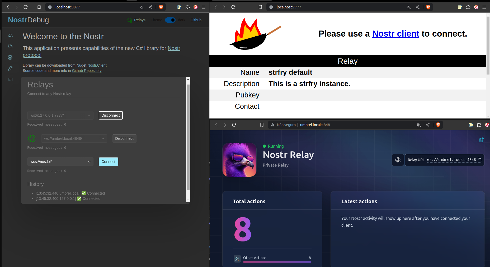

# Dev Relay for Debug
Before connecting your innovative client to existing NOST relays, you may want to validate your implementations in your development environment.

In this repository you can find a strfry relay (https://github.com/hoytech/strfry/) ready for use in a development environment together with the nodes-debug page (https://github.com/Marfusios/nostr-client) running on localhost, to explore your localhost relay data.

Strfry will run in port 7777.
Nostr Debug will run in port 8077.

Nostr Debug in localhost can connect to other relays into your private network.



## How to run

```docker-compose -f dev-relay-debug/docker-compose.yml up```

## Dependencies
 - Docker, docker-compose
 - git